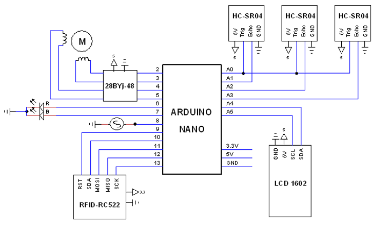
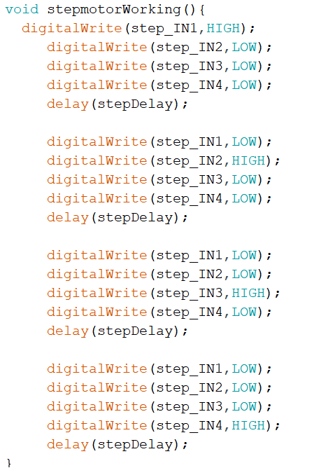
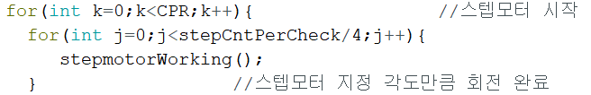
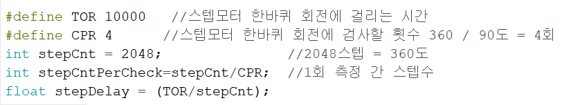
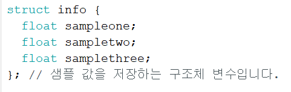
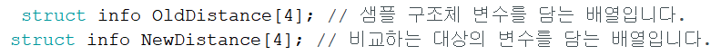
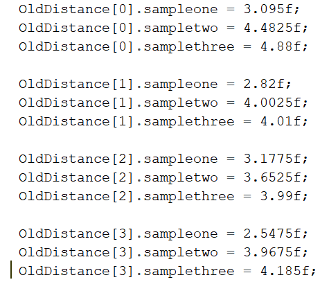
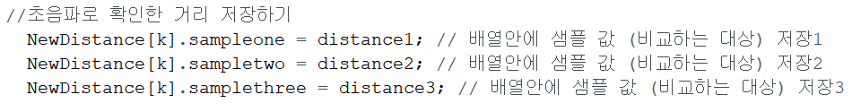
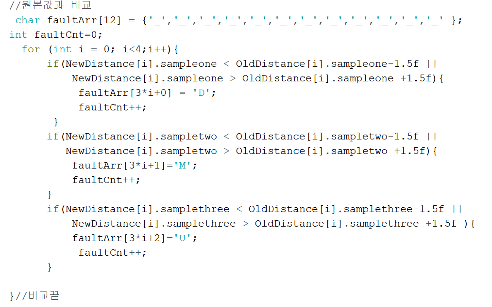
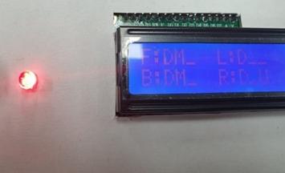

# 개요
* 초음파 센서의 거리 측정 능력을 이용하여 고정된 물체의 거리정보를 얻을 수 있다.
* 제품 생산과정에서 불량품이 발생한다면 기존 정상 제품의 거리 값과 차이가 발생할 것이고, 이 점을 이용하여 결함 있는 제품을 검출한다. 
***
# 사용한 기술
### 마이크로컨트롤러
* Arduino Nano

### 사용 언어
* C

### 센서
* Ultrasonic Sensor(HC-SR04) * 3
* RFID(RC522)
* RGB LED 
* Buzzer
* CLCD 1602 (I2C Interface)
* Step Motor 28BYJ-48 5VDC

***
# 회로도

***
# Point of Interest
### 스텝모터의 각도와 회전 속도
* 스텝모터와 연결된 4개의 포트에서 순차적으로 디지털 신호를 보내는 함수를 만들었고, 이 함수를 for 루프에서 반복시켰다.
+ 속도 제어를 위해 360도 회전에 필요한 시간(ms)/2048 만큼을 스텝간 delay로 놓았다.

+ 원하는 각도만큼 회전시키기 위해 for문의 반복 회수를 조절했고, 1회전에 필요한 스텝 수에서 원하는 각도의 비율만큼 스텝을 진행시키면 된다. 

* 1회전이 2048스텝이었고, x도를 회전하기 위해 2048/x 스텝을 반복시켰다. 

 
- 단 delay가 너무 짧아지면 정상적으로 작동하지 않는다.

### 불량 위치를 LCD에 표시
* 물체가 90도씩 4회에 걸쳐 회전하는 동안 3개의 초음파 센서가 거리를 측정하므로, 총 12개의 거리 정보를 얻을 수 있다.
- 구조체 타입 정의하고,

* 구조체 배열로 12개의 값을 저장했다.

+ 샘플 구조체에 정상품 값을 입력하고,

- 측정중인 물체의 측정값을 입력했다.

* LCD에 불량위치를 출력하고자 했고, ‘_’로 초기화된 12바이트 배열을 준비했다.
+ for문을 돌면서 원본과 측정값이 담긴 구조체, 배열을 같은 index로 접근하여 비교하고, 불량이면 배열에 다른 char를 할당했다. 

- 이 배열을 토대로 LCD에 불량 위치를 출력했다.

