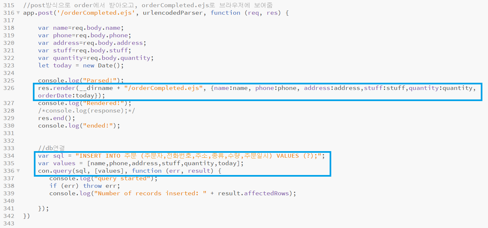
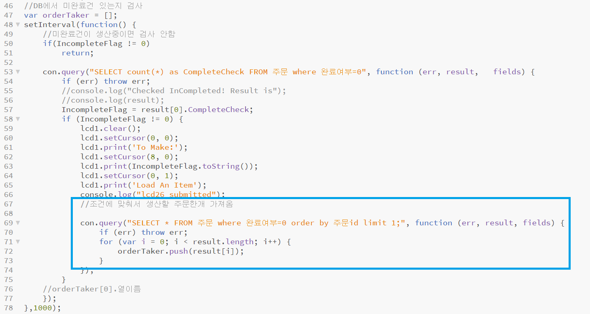
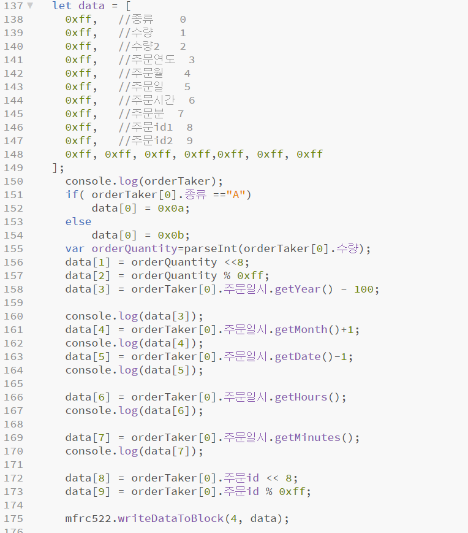
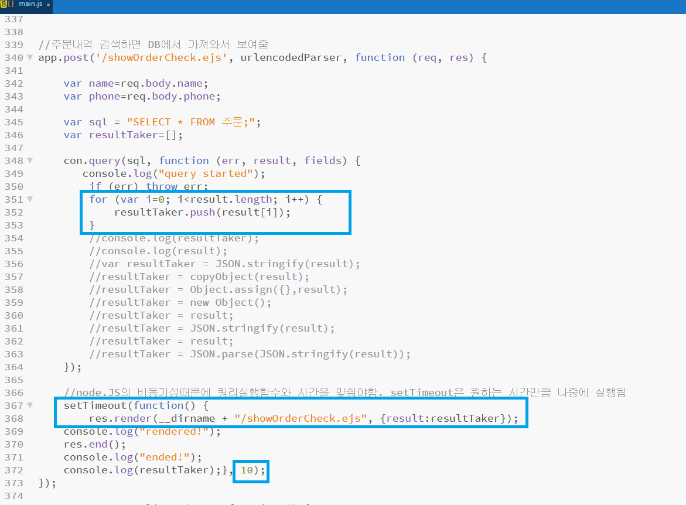

# 개요
* 소비자가 원하는 제품 정보를 웹을 통해 입력하여 공장에서 맞춤 생산이 시작된다. 
* 소비자가 결정한 정보대로 제조 공정이 선택된다.  
* 제작 시작 시간, 자재 정보, 제품 생산 단계, 제작 완료 시점 등의 정보를 생산 현장의 센서로부터 획득하여 데이터베이스를 구축한다.

***

# 사용한 기술
### 마이크로컨트롤러
* 라즈베리파이 4B
### 플랫폼
* node.js
### 언어
* JavaScript
### 데이터베이스
* MSSQL Server 2019
***

# Point of Interst
### 웹에서 입력된 정보를 DB에 저장
* HTML페이지에서 post방식으로 정보를 입력/전송한다.    
  
* 주문 정보를 새 페이지(orderCompleted.ejs)에 변수를 전달해서 보여주고, DB에 저장한다.    
    
### DB에 생산할 주문이 있는지 주기적으로 검사
* setInterval함수로 1초 주기로 주문을 검사했고, 있다면 orderTaker 배열에 주문 정보를 복사했다.   
  
### RFID에 DB에서 가져온 정보 쓰기  
* 주문정보가 담긴 배열을 16진수 데이터로 변환해서 RFID카드에 정보를 전달했다.      

* 마찬가지로 공정 마지막에 도달하면 RFID카드를 초기화하고, DB에 완료여부를 Update했다.  
### DB정보를 웹브라우저에 전달하기
* query함수에서 결과를 담는 result의 모든 항목을 복사(for문으로 각 index마다 복사)해서 query함수 외부에서 사용하도록 했다.  
* query함수 이후에 브라우저로 전송하는 함수를 setTimeout을 이용해 10ms 지연시켰다.   

